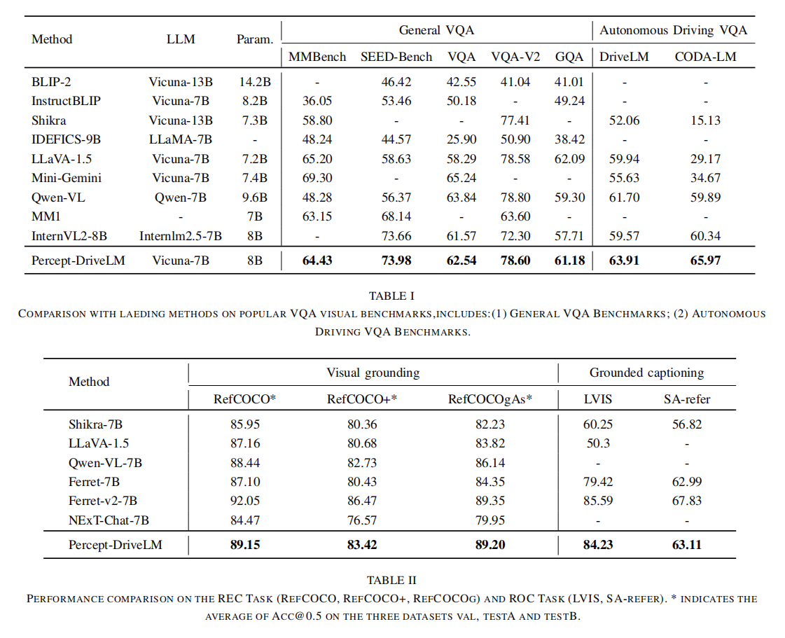

#### Towards Robust Autonomous Driving: Conditional Multimodal Large Language Models for Fine-Grained Perception

------

This repository contains the code for the paper titled "Towards Robust Autonomous Driving: Conditional Multimodal Large Language Models for Fine-Grained Perception" which is submitted to ICRA2025.

#### Main PipeLine


#### Main Results



#### Quick Start

------

##### Install Packages

```
conda create -n percepdrivelm python=3.10
conda activate percepdrivelm
pip install -r requirements.txt
```

##### Data Preparation

Please refer to [dataset_prepare.md](https://github.com/PhoenixZ810/MG-LLaVA/blob/master/dataset_prepare.md).

##### Train model

- **Step 1**, Pretraining.

  ```
  bash script/train_pretrain.sh 
  ```

- **Step 2**, Fine-tuning.

  ```
  bash script/train_sft.sh
  ```
  
#### Acknowledgement
------
We are preparing for open-source release.  This repository is being continuously updated.  Please feel free to contact us if you have any questions.
